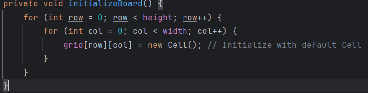
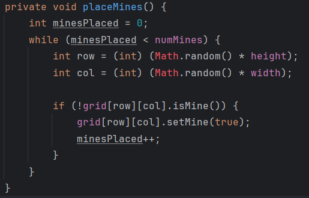
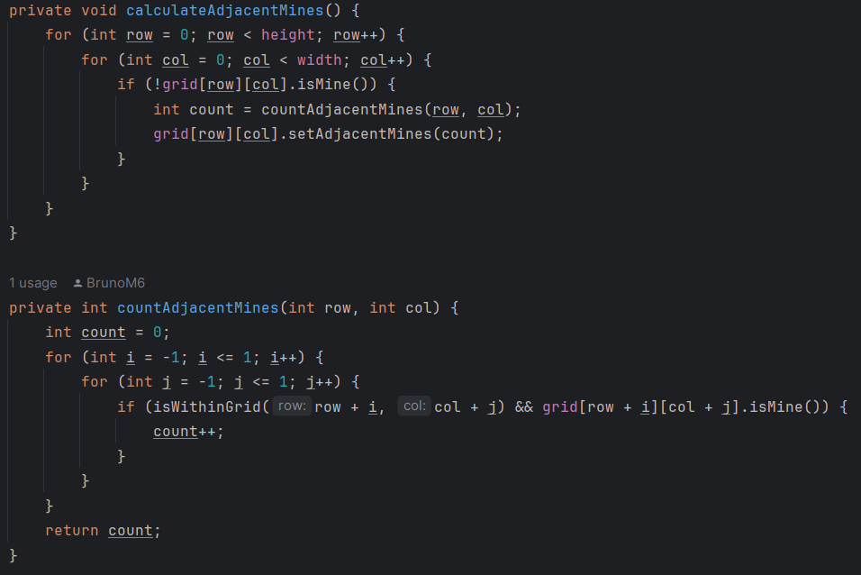
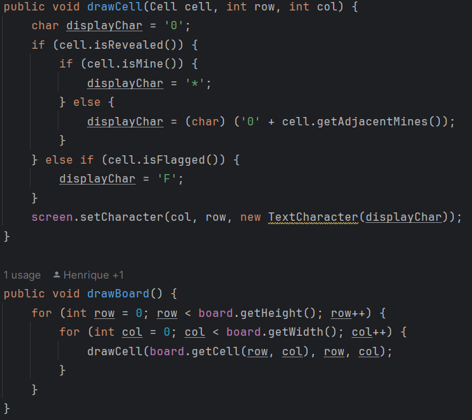

# LDTS23

## LDTS_T01_G - MINSESWEEPER

O nosso projeto incide sobre o famoso jogo Minesweeper. O jogo consiste num campo de quadrados retangular, no qual estão escondidas bombas. O objetivo do jogador é revelar todos os quadrados que não têm minas, sem nunca tentar revelar os quadrados com minas. No caso de selecionar um quadrado com bomba, o jogo termina e o jogador perde.
Selecionando os quadrados, tanto pode aparecer um número, que indica o número de minas que se encontram nas casas adjacentes, um espaço em branco ou uma bomba.
Opcionalmente, o jogador pode marcar qualquer quadrado que acredite que contém uma mina com uma flag, bastando para isso carregar com o botão direito do rato. No caso, também é possível carregar com os dois botões do mouse num número que contenha tantas flags imediatamente à sua volta

O projeto foi desenvolvido por João Proença, Bruno Moreira e Rodrigo Resende.

### IMPLEMENTED FEATURES

Implementamos diversas features:
>Feature para inicializar o Board do jogo em modo default:

>Feature para colocar as minas no Board do jogo:

>Feature para avaliar quantas minas existem à volta no Board:

>Feature para desenhar as celulas todas do Board, contendo ou não minas, e estando ou não reveladas:

### PLANNED FEATURES

Além das features anteriores mencionadas iremos implementar muitas mais como por exemplo:
> Implementar uma funcionalidade que nos permita escolher o tamanho do board do jogo;
> Implementar uma funcionalidade que nos permita definir inicialmente quantas minas estarão presentes no jogo, de modo a dificultar ou facilitar o jogo para o utilizador;
> Implementar um menu muito mais funcional para o utilizador;
> Entre outras que podem ser decididas futuramente;

### DESIGN

> This section should be organized in different subsections, each describing a different design problem that you had to solve during the project. Each subsection should be organized in four different parts:

- **Problem in Context.** The description of the design context and the concrete problem that motivated the instantiation of the pattern. Someone else other than the original developer should be able to read and understand all the motivations for the decisions made. When refering to the implementation before the pattern was applied, don’t forget to [link to the relevant lines of code](https://help.github.com/en/articles/creating-a-permanent-link-to-a-code-snippet) in the appropriate version.
- **The Pattern.** Identify the design pattern to be applied, why it was selected and how it is a good fit considering the existing design context and the problem at hand.
- **Implementation.** Show how the pattern roles, operations and associations were mapped to the concrete design classes. Illustrate it with a UML class diagram, and refer to the corresponding source code with links to the relevant lines (these should be [relative links](https://help.github.com/en/articles/about-readmes#relative-links-and-image-paths-in-readme-files). When doing this, always point to the latest version of the code.
- **Consequences.** Benefits and liabilities of the design after the pattern instantiation, eventually comparing these consequences with those of alternative solutions.

**Example of one of such subsections**:

------

#### THE JUMP ACTION OF THE KANGAROOBOY SHOULD BEHAVE DIFFERENTLY DEPENDING ON ITS STATE

**Problem in Context**

There was a lot of scattered conditional logic when deciding how the KangarooBoy should behave when jumping, as the jumps should be different depending on the items that came to his possession during the game (an helix will alow him to fly, driking a potion will allow him to jump double the height, etc.). This is a violation of the **Single Responsability Principle**. We could concentrate all the conditional logic in the same method to circumscribe the issue to that one method but the **Single Responsability Principle** would still be violated.

**The Pattern**

We have applied the **State** pattern. This pattern allows you to represent different states with different subclasses. We can switch to a different state of the application by switching to another implementation (i.e., another subclass). This pattern allowed to address the identified problems because […].

**Implementation**

The following figure shows how the pattern’s roles were mapped to the application classes.

These classes can be found in the following files:

- [Character](https://web.fe.up.pt/~arestivo/page/courses/2021/lpoo/template/src/main/java/Character.java)
- [JumpAbilityState](https://web.fe.up.pt/~arestivo/page/courses/2021/lpoo/template/src/main/java/JumpAbilityState.java)
- [DoubleJumpState](https://web.fe.up.pt/~arestivo/page/courses/2021/lpoo/template/src/main/java/DoubleJumpState.java)
- [HelicopterState](https://web.fe.up.pt/~arestivo/page/courses/2021/lpoo/template/src/main/java/HelicopterState.java)
- [IncreasedGravityState](https://web.fe.up.pt/~arestivo/page/courses/2021/lpoo/template/src/main/java/IncreasedGravityState.java)

**Consequences**

The use of the State Pattern in the current design allows the following benefits:

- The several states that represent the character’s hability to jump become explicit in the code, instead of relying on a series of flags.
- We don’t need to have a long set of conditional if or switch statements associated with the various states; instead, polimorphism is used to activate the right behavior.
- There are now more classes and instances to manage, but still in a reasonable number.

#### KNOWN CODE SMELLS

> This section should describe 3 to 5 different code smells that you have identified in your current implementation.

### TESTING

- Screenshot of coverage report.
- Link to mutation testing report.

### SELF-EVALUATION

- João Proença: 35%
- Bruno Moreira: 35%
- Rodrigo Resende: 30%