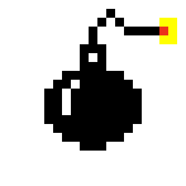
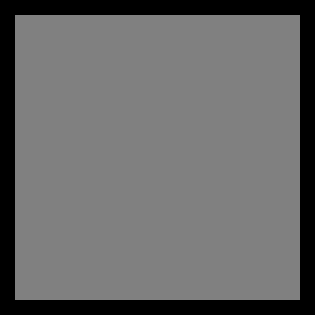

# LDTS23

## LDTS_T01_G - MINESWEEPER

O nosso projeto incide sobre o famoso jogo Minesweeper. O jogo consiste num campo de quadrados retangular, no qual estão escondidas bombas. O objetivo do jogador é revelar todos os quadrados que não têm minas, sem nunca tentar revelar os quadrados com minas. No caso de selecionar um quadrado com bomba, o jogo termina e o jogador perde.
Selecionando os quadrados, tanto pode aparecer um número, que indica o número de minas que se encontram nas casas adjacentes, um espaço em branco ou uma bomba.
Opcionalmente, o jogador pode marcar qualquer quadrado que acredite que contém uma mina com uma flag, bastando para isso carregar com o botão direito do rato. No caso, também é possível carregar com os dois botões do mouse num número que contenha tantas flags imediatamente à sua volta

O projeto foi desenvolvido por João Proença, Bruno Moreira e Rodrigo Resende.

### FEATURES IMPLEMENTADAS

Já implementamos algumas funcionalidades base, como as classes Cell e Board que inicializam o board e guardam a informação necessária em relação ao mesmo, a class Draw que serve neste momento como base para a GUI do nosso projeto, e o básico game loop pattern, entre outras.

### FEATURES PLANEADAS

Além das features anteriores mencionadas iremos implementar muitas mais como por exemplo:
> Implementar inputs de rato;
> Implementar uma funcionalidade de dificuldade que permite ao jogador escolher a dificuldade;
> Implementar um menu muito mais funcional para o utilizador;
> Implementar uma funcionalidade de tempo e um consequente ranking system;
> Entre outras que podem ser decididas futuramente.

### DESIGN PATTERNS

>State pattern. Utilizamos o state pattern para definir os diversos estados do jogo, de forma a, dependendo do estado do jogo, se alterar o comportamento interno do código, especialemente no que toca a GUI e inicialização do tabuleiro.
>Factory method pattern. A classe base controller cria objetos mas permite às sublasses alterar o tipo de objeto que é criado.

### CONSEQUÊNCIAS

A utilização do state pattern ajuda a introduzir novos estados de forma simples, e a organizar as diferentes operações efetuadas mediante os inputs do jogador, também aumenta o número de classes, simplificando cada classe individual por consequência. O factory method adiciona uma camada de abstração aos controllers, facilitando a sua implementação e diminuindo a probabilidade de erro por consequência. Também separa a mecânica de criação de objeto da de implementação, permitindo ao desenvolvedor analisar e encontrar erros de forma mais rápida e simples.

### MOCKUPS

> Já temos alguns designs do projeto em mente e desenhados, estamos a considerar a utilização de pngs no tabuleiro, de forma a criar uma GUI fácil de entender.
>Flag

>Bomba

>Espaço revelado

>Espaço não-revelado
.png)

#### CODE SMELLS CONHECIDOS

Nesta implementação base, encontramos alguns possíveis code smells, como o projeto está sujeito a mudança e em desenvolvimento, atentar a possíveis problemas de design o mais cedo possível apresenta-se como prioridade.
> Constructor overloading em Board.java, temos diversos construtores para cenários diferentes, daí é necessário ser prudente e cuidadoso para utilizar o constructor correto na ocasião correta.
> Draw.java apresenta-se como uma classe bastante complexa que gere muitos elementos, visto que gere todo o processo de desenho, no futuro será repartida e tranformada em métodos mais simples.

### SELF-EVALUATION

- João Proença: 35%
- Bruno Moreira: 35%
- Rodrigo Resende: 30%